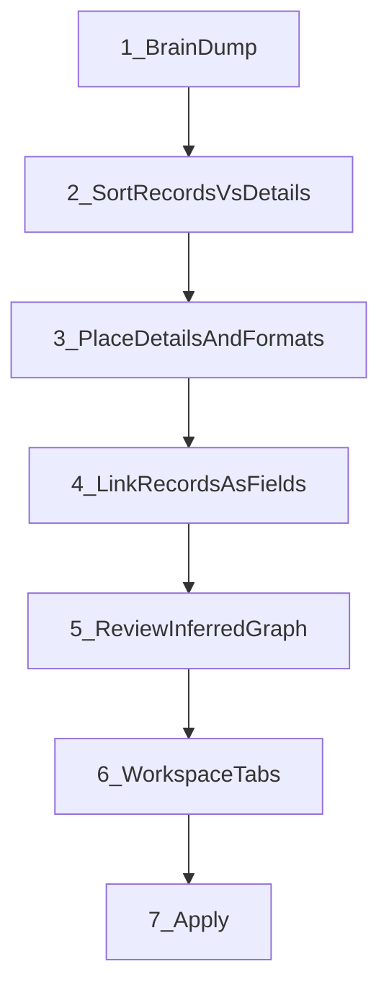

# Design Brainstorm UI — Concepts → Items → Fields → Inferred Links

## Overview

Replace the “Items → Info → Connections → Views” mental model with a **brainstorm-first** Design flow: users dump **concept labels** (not data values), sort each into **Record** (Item type) vs **Detail** (field), place details onto records with formats, and treat **Record-as-field** as the only way links appear. **Connections are inferred** — not a separate authoring step. The shell is warm and coachy (clear step instructions) while staying fully functional.

## Locked product decisions

1. **Scalar vs Item is the only structural choice.**  
   - Scalar (“Description”, “Due date”) → stored *inside* an Item; never creates a relationship.  
   - Item (“Tag”, “Note”, “Student”) → its own table; can appear as a linked field on other Items.

2. **M:N is only for Item↔Item links.**  
   Putting Tag on Note creates a junction (chips). A text “description” never becomes M:N.

3. **Users do not maintain a Connections panel as a required step.**  
   Relationships are auto-created/updated when someone sets a field’s type to “Link to Item …”. Storage defaults:
   - **Many** (junction / chips) — default for reusable catalogs (Tag, Reference, Student on Class).  
   - **One** (assignment / optional FK) — explicit override (“Assigned teacher”).  
   - **Owned by** (containment) — explicit override or first workspace container (“Notebook contains Notes”).  
   Advanced storage labels stay in Advanced/map only.

4. **First ship = new entry path, not a full Design rewrite.**  
   - Blank / “Brainstorm” mode uses the new flow.  
   - Existing studio (item editor + tabs + map) remains for refining an applied schema.  
   - Setup wizard’s separate “Connections” step is removed or collapsed into “Review links”.

5. **Workspace tabs stay as today** (primary Item + joins + columns), but joins are pre-filled from inferred relationships when a tab is created.

## Answers to the design questions

| Question | Answer in this UI |
|---|---|
| What entities exist? | Concepts promoted to **Item**. |
| What fields sit within which entities? | Scalars (and Item-links) assigned onto an Item card. |
| What format? | Type chips on each scalar: short text, long text, date, choice, number, checkbox, URL, bullets. |
| Which entities are available as fields? | Any other Item — pick “Link to [Item]” as the field type. |
| What connections? | Auto from Item-link fields; no separate connection authoring for the default path. |
| Only non-entity fields are M:N? | No — **only entity/Item links** are M:N (or One / Owned-by). Scalars are never connections. |
| Must the user decide a connection? | No. Decide **Many / One / Owned by** only when linking Items (Many is default). |

## How the user says “Item type” vs “field”

**Brainstorm is not a list of unique data values.**  
It is a list of **concept labels** — names for kinds of records and pieces of info (e.g. `Note`, `Tag`, `title`, `description`).  
Not instance values like `Getting started` or `Ideas`. Those appear later in Workspace when entering real data.

**Communication pattern (two moments):**

1. **Dump (ambiguous on purpose)**  
   User types/pastes concept names as soft chips. No Item/field choice yet. Instruction:  
   *“List anything you might track — kinds of records and bits of info. Don’t worry which is which yet.”*

2. **Sort (explicit choice on each chip)**  
   Each chip gets one clear control — a segmented toggle (not jargon):
   - **Record** (= Item type) — “You’ll have many of these”  
   - **Detail** (= field) — “Lives on a record”  
   Soft suggestion from heuristics (pre-select, easy to flip).  
   Empty state coaching under the buckets:  
   - Records: *“Note, Tag, Student, Class…”*  
   - Details: *“title, description, due date, status…”*

**Visual language so the choice sticks:**
- **Records** become roomy cards (containers you nest into).  
- **Details** stay compact pills that snap onto a card in Place.  
- Color/weight: Records slightly stronger surface; Details quieter. No emoji.

**Later correction:** Promote/demote from Place or Review (*“Make this its own record”* / *“Turn into a detail on…”*).

**Linking Items (not values):** On a Record card, adding *“Also track: Tag”* means Tag-as-linked-field, not typing tag names. Many/One/Owned-by appears only here.

## Target UX (flow)

### Phase 1 — Brain dump
- Soft chip canvas + one-line input (“Add another…”); Enter / comma / paste lines.
- Starter examples as ghost chips you can keep or dismiss: Note, Tag, title, description…
- Coach line always visible under the headline (see Aesthetic).

### Phase 2 — Sort (Record vs Detail)
- Same chips, now with Record | Detail toggle; optional two gentle drop zones.
- Progress hint: *“3 records · 5 details — looking good”*.

### Phase 3 — Place details + formats
- Record cards in a calm grid; Details tray on the side/bottom.
- Drag (or click-assign) Detail → Record; format picker on the pill (Short text, Long text, Date…).
- Auto-offer a Title/Name detail if a Record has none.

### Phase 4 — Link records
- On a Record: *“Connect another record…”* → pick Tag → default **Many**.
- Plain language: Many = “can pick several”; One = “at most one”; Owned by = “belongs inside”.

### Phase 5 — Tabs + Apply
- Auto-suggest tabs; joins from linked records; Apply unchanged.

## Aesthetic — friendly, clear, still functional

Direction: **warm workshop**, not admin console / not toy. Soft atmosphere, expressive type, one calm accent. Avoid purple-glow / cream-terracotta clichés and emoji.

**Visual system (CSS variables on brainstorm shell):**
- Background: soft paper wash + subtle grain or faint grid (atmosphere, not flat white).
- Type: distinctive display for the step title; readable soft sans for body/coach.
- Accent: one leafy teal or coral used sparingly for primary CTA and selected Record.
- Chips: rounded-rect (not full pills), light fill, clear selected state.
- Record cards: gentle radius, soft edge, enough padding to feel inviting; Details nest as smaller chips inside.
- Motion (2–3 intentional): chip appear; Record|Detail flip; Detail settle onto card.

**Instruction pattern (always on, never a wall of help):**
- Step title (one job): e.g. *“What might you track?”*
- One coach sentence under it.
- Inline examples in muted text near the control.
- Footer next button disabled with a friendly reason until the step is ready (*“Mark each chip as a Record or a Detail to continue”*).

**Step copy (locked draft):**

| Step | Title | Coach |
|---|---|---|
| Dump | What might you track? | Jot kinds of records and bits of info. You’ll sort them next. |
| Sort | Record or detail? | Records are things you’ll have many of. Details live on a record. |
| Place | Where does each detail live? | Drop details onto a record, then pick a format. |
| Link | Connect records | Add another record as a field when they belong together — like Tags on a Note. |
| Review | Does this look right? | Links were created from the records you connected. |

**First viewport (hero budget):** brand Design, one title, one coach line, one CTA row (Continue / Use a template), dominant dump canvas — no stats, no secondary panels.

## Mapping to current schema/runtime

No new storage primitives. Compile brainstorm state → existing `entity_types` + `relationships` + `views`:

| Brainstorm action | Schema effect |
|---|---|
| Promote to Item | `entity_types[id]` (`primary_row`; first container-like Item may be `container`) |
| Scalar on Item | `fields[name]` via `defaultFieldDef(type)` |
| Link to Item · Many | junction relationship + `item_link` marker; `attachJoinToView` |
| Link to Item · One | assignment + FK field |
| Link to Item · Owned by | containment + child FK |
| Suggest tabs | `createView` + joins from that entity’s relationships |

Reuse:
- [`static/js/design/design-actions.js`](static/js/design/design-actions.js) — `createItemType`, `addValueToEntity`, `addLinkToEntity`
- [`static/js/view-columns.js`](static/js/view-columns.js) — `attachJoinToView`
- [`static/js/design/item-editor.js`](static/js/design/item-editor.js) — later sync with link combobox patterns
- Hide / deprecate required use of [`connection-panel.js`](static/js/design/connection-panel.js) on the default path

## UI composition (first viewport)

One composition, not a dashboard:

1. **Brand**: Design  
2. **Headline**: “What might you track?”  
3. **Coach**: “Jot kinds of records and bits of info. You’ll sort them next.”  
4. **CTA**: Continue · Use a template  
5. **Dominant surface**: full-bleed dump canvas (soft paper wash, chip input)

Later steps morph the same canvas (sort → place → link); no multi-panel admin chrome until Review/Tabs.

## Implementation plan

### A. Brainstorm model (in-memory, Design-only)
New module `static/js/design/brainstorm.js`:
- `concepts[]`: `{ id, label, kind: "unset"|"item"|"scalar", suggestedKind }`
- `placements[]`: `{ conceptId, entityId, fieldType?, linkTargetId?, cardinality: "many"|"one"|"owned" }`
- `compileToSchema(concepts, placements, baseSchema) → workingSchema`

### B. Entry + flow shell
- In [`design-tab.js`](static/js/design/design-tab.js): if blank / user chooses “Brainstorm”, mount `brainstorm-flow.js` instead of studio.
- Steps UI: Dump → Sort → Place → Links → Review → Tabs (reuse studio workspace panel on last step).
- “Open studio” escape hatch anytime after Sort.

### C. Compile + validate
- Compile on each step; run existing `/api/schema/validate` before Apply.
- Ensure demoting an Item that is linked elsewhere warns and offers to convert links to scalars or remove them.

### D. Wizard cleanup
- [`setup-wizard.js`](static/js/design/setup-wizard.js): remove standalone Connections step; show read-only inferred links; or route wizard users into brainstorm flow.

### E. Copy
- Update [`help-text.js`](static/js/design/help-text.js): connections are “links you add as fields”, not a third top-level concept.

## Out of scope (v1)

- AI auto-clustering of brain-dump text
- Multi-hop joins / relationship attributes (role, ordered links)
- Replacing the ERD map (keep as optional Advanced)
- Changing runtime junction/containment engines

## Suggested build order

1. `brainstorm.js` model + `compileToSchema` (unit-testable against tagged KB shape)
2. Dump + Sort UI → creates Items only
3. Place scalars + formats
4. Link-to-Item with Many/One/Owned → relationships
5. Review graph + auto tabs
6. Wire as blank-start entry; collapse wizard Connections step
7. Polish: heuristics, demote/promote edge cases, help copy

## Success criteria

- A new user can go from empty → Notes/Tags/References-like schema **without** opening a Connections panel.
- “Description” never creates a relationship; “Tags” on Note always does (default Many).
- Inferred relationships round-trip through Apply and show as chip columns on the Notes tab.
